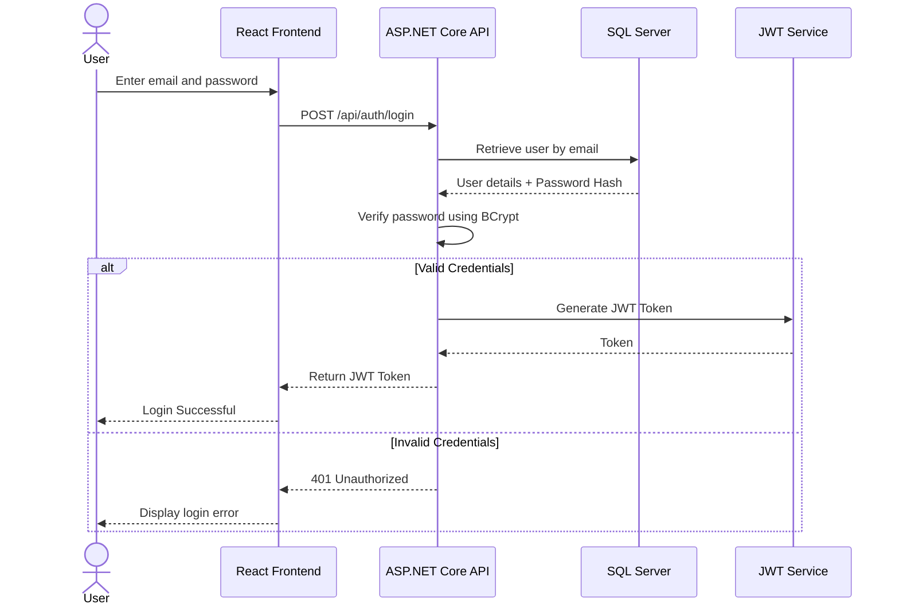

# Login Authentication Sequence

```mermaid
sequenceDiagram

actor User
participant React as React Frontend
participant API as ASP.NET Core API
participant DB as SQL Server
participant JWT as JWT Service

User->>React: Enter email and password
React->>API: POST /api/auth/login
API->>DB: Retrieve user by email
DB-->>API: User details + Password Hash
API->>API: Verify password using BCrypt

alt Valid Credentials
    API->>JWT: Generate JWT Token
    JWT-->>API: Token
    API-->>React: Return JWT Token
    React-->>User: Login Successful
else Invalid Credentials
    API-->>React: 401 Unauthorized
    React-->>User: Display login error
end
```